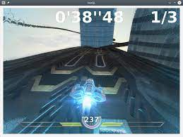
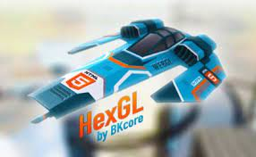
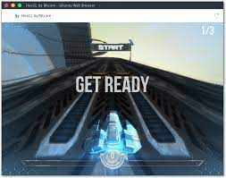
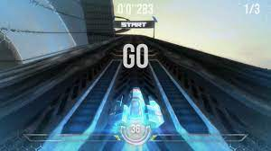

HexGL
=========

Source code of [HexGL](http://hexgl.bkcore.com), the futuristic HTML5 racing game by [Thibaut Despoulain](http://bkcore.com)

## Branches
  * **[Master](https://github.com/BKcore/HexGL)** - Public release (stable).

## Screenshots

     

     

     
     

## License

Unless specified in the file, HexGL's code and resources are now licensed under the *MIT License*.

## Installation

	cd ~/
	git clone git://github.com/BKcore/HexGL.git
	cd HexGL
	python -m SimpleHTTPServer
	chromium index.html

To use full size textures, swap the two textures/ and textures.full/ directories.

## Note

The development of HexGL is in a hiatus for now until I find some time and interest to work on it again.
That said, feel free to post issues, patches, or anything to make the game better and I'll gladly review and merge them.
